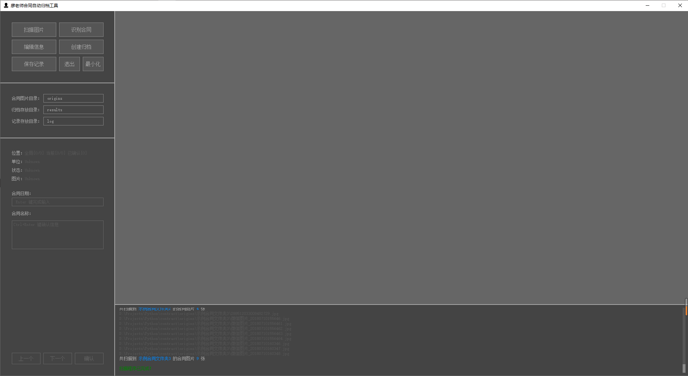

### 项目介绍

一个可以自动识别合同照片里面的信息，并归档整理成Word文件的Qt程序

### 使用方法

1. 将不同种类的合同文件建立对应的文件夹，然后将文件夹放进 `origins` 目录内。
2. 启动 `python main.py` ，打开程序界面。
3. 进行简单的设置，点击 `扫描合同图片` -> `识别合同信息`，此时程序会自动进行合同信息的识别。
4. 如果合同文件太多，并且此时想暂停程序，可点击 `保存程序记录`，下次启动程序时会从上次的记录中恢复。
5. 识别完成后，可点击 `编辑识别结果`，对部分未识别出的或者识别错误的结果进行手动修改。
6. 点击 `创建合同归档`，此时创建一个 `completed` 文件夹，并将归档结果的 word 文件存放在其内。

### 程序界面

